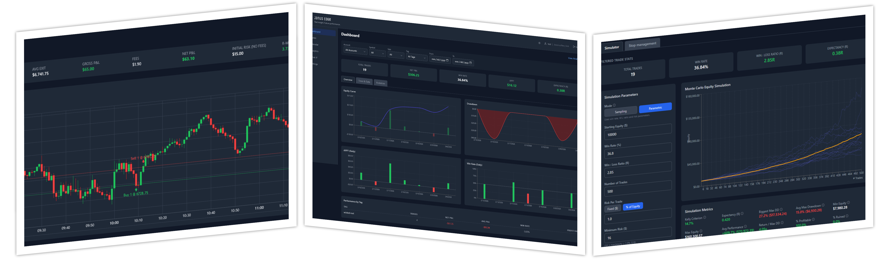

# Janus Edge - Trading journal

Janus Edge is an open-source, self-hosted trading journal built to help you turn raw executions into structured review, performance insight, and better decision-making.



## Feature Highlights

- **Import and reconstruct trades** from supported CSV exports such as NinjaTrader and Quantower
- **Journal every trade** with notes, tags, fees, initial risk, screenshots, and media
- **Review trades in chart context** with executions plotted on candlestick data
- **Track performance over time** with dashboard metrics, equity curve, drawdown, and tag-based analysis
- **Study trading patterns** through calendar review, time-of-day analysis, and deeper analytics
- **Test what-if scenarios** with Monte Carlo simulations and stop-management tools
- **Back up and restore your data** with portable export and merge-based restore support

## Installation

### Prerequisites

For the default setup, install:

- Git
- Docker Desktop, or Docker Engine with Docker Compose support

Make sure these local ports are available before starting the stack or change them in the compose file:

- `5173` for the frontend
- `5000` for the backend API
- `27017` for MongoDB
- `9000` for MinIO API
- `9001` for the MinIO console

### Quick Start With Docker

Clone the repository and start the full local stack:

```bash
git clone https://github.com/diridevelops/JanusEdge.git
cd JanusEdge
cp .env.example .env
docker compose up -d --build
```

If you are using Windows PowerShell, replace `cp` with `copy`.

This starts:

- the React frontend
- the Flask backend
- MongoDB
- MinIO

After startup, open [http://localhost:5173](http://localhost:5173).

To stop the stack later:

```bash
docker compose down
```

### Development

For mixed local development, install these additional prerequisites:

- Python 3.11+
- Node.js 20+

If you have not cloned the repository yet, do that first:

```bash
git clone https://github.com/diridevelops/JanusEdge.git
cd JanusEdge
```

Start MongoDB and MinIO in Docker:

```bash
docker compose up mongo minio -d
```

Run the backend locally:

```bash
cd backend
cp .env.example .env
python -m venv .venv
source .venv/bin/activate
pip install -r requirements.txt
flask run --port 5000
```

Run the frontend locally:

```bash
cd frontend
cp .env.example .env.local
npm install
npm run dev
```

Default local URLs:

- Frontend: `http://localhost:5173`
- Backend API: `http://localhost:5000`
- MinIO Console: `http://localhost:9001`

### Updating An Existing Checkout

If you already have the repository cloned, commit or stash local changes before updating.

For the Docker-based stack:

```bash
git pull --rebase
docker compose up -d --build
```

For mixed local development, pull the latest code, refresh dependencies, and restart the app processes:

```bash
git pull --rebase
docker compose up mongo minio -d
cd backend
source .venv/bin/activate
pip install -r requirements.txt
cd ../frontend
npm install
```

After that, restart the Flask backend and Vite frontend if they were already running.

## Documentation

Long-form project documentation lives in [docs/README.md](./docs/README.md).

Recommended starting points:

- [Getting Started](./docs/getting-started.md)
- [Usage Guide](./docs/usage.md)
- [Troubleshooting](./troubleshooting.md)

## Project Structure

- `backend/`: Flask API, MongoDB repositories, CSV import logic, analytics, and media handling
- `frontend/`: React, TypeScript, and Vite single-page application
- `trade_examples/`: sample CSV files for import testing
- `docs/`: long-form contributor and operator documentation

## Security

Follow the reporting process in [SECURITY.md](./SECURITY.md) for vulnerabilities.

## License

The original code in this repository is licensed under the Apache License 2.0. See [LICENSE](./LICENSE).

Third-party dependencies and bundled assets remain under their own licenses.