# Architecture

## Overview

Janus Edge is a web application for importing futures execution exports, reconstructing trades, journaling them, attaching media, and analyzing results.

The codebase is organized as a monorepo with:

- a React and TypeScript frontend in `frontend/`
- a Flask backend in `backend/`
- MongoDB for persisted application data
- MinIO for media object storage
- Docker Compose for local orchestration

## System Diagram

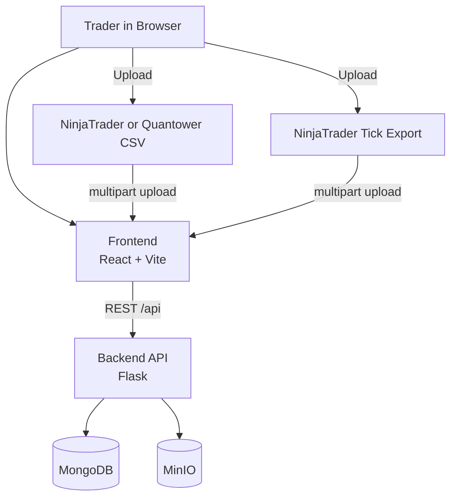

## Runtime Topology

In local development, the main runtime pieces are:

1. The Vite dev server on port `5173`
2. The Flask API on port `5000`
3. MongoDB on port `27017`
4. MinIO on ports `9000` and `9001`

When running the frontend in development mode, browser requests to `/api` are proxied by Vite to the Flask backend.

## Local Runtime Diagram

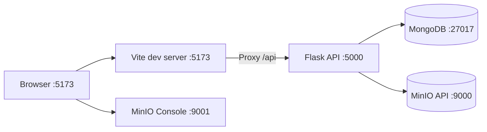

## Main Data Flows

### Authentication

- The frontend calls `/api/auth/*` endpoints.
- The backend issues JWT access tokens.
- The frontend stores the token in `sessionStorage` and attaches it on every API request.

### CSV Import

- A user uploads a CSV export through the import wizard.
- The backend detects the platform format and parses the file.
- Parsed executions are reconstructed into trades.
- On finalization, the backend creates or reuses accounts, writes an import batch, stores executions and trades, and records an audit log entry.

### Trade Review and Journaling

- Trade lists and detail views are loaded from `/api/trades`.
- Trade detail pages load executions plus OHLC data from `/api/market-data/ohlc`.
- Notes, tags, initial risk, wish-stop, and target values are stored on the trade document.

### Media Attachments

- File metadata is stored in MongoDB in the `media` collection.
- Binary file content is stored in MinIO.
- The backend returns presigned download URLs for access.

### Analytics and What-If

- Analytics endpoints aggregate trade data from MongoDB.
- What-if endpoints reuse persisted trade and stored market-data information to calculate stop overshoot statistics and wider-stop simulations. The stop-management simulator supports replay from stored 1-minute candles or stored raw ticks.
- Monte Carlo simulation is computed in the backend and rendered by the frontend.

### Backup and Restore

- Export creates a ZIP archive containing `manifest.json`, `data.json`, and media binaries.
- Restore merges that archive into the authenticated destination user.
- Portable user settings such as timezones, starting equity, and symbol mappings are restored as part of that flow.

## Import And Backup Flows

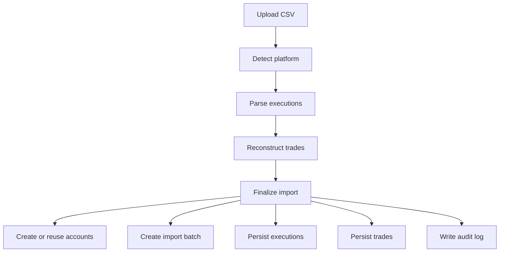

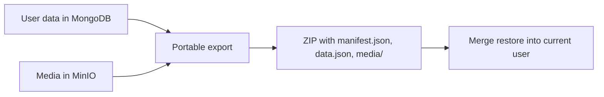

## Code-Level Component Map

### Frontend

- `src/pages/`: route-level views such as Dashboard, Trades, Import, Analytics, What-if, and Settings
- `src/api/`: thin HTTP wrappers around backend endpoints
- `src/contexts/`: auth, filters, theme, and toast state
- `src/components/`: reusable UI, charts, trade, analytics, import, and layout components

### Backend

- `app/__init__.py`: Flask app factory and blueprint registration
- `app/auth/`: authentication plus backup export and restore
- `app/imports/`: CSV upload, parsing, reconstruction, and import finalization
- `app/trades/`: trade CRUD and search
- `app/analytics/`: reporting and Monte Carlo simulation
- `app/market_data/`: stored market-data retrieval and candle access
- `app/media/`: upload, listing, URL generation, and deletion for trade media
- `app/whatif/`: stop analysis and simulation endpoints
- `app/repositories/`: MongoDB data-access layer
- `app/models/`: document-construction helpers used before inserts

## Storage Responsibilities

### MongoDB

MongoDB stores the application records for:

- users
- trade accounts
- import batches
- executions
- trades
- tags
- market-data dataset metadata
- media metadata
- audit logs

### MinIO

MinIO stores the binary media files for trade attachments.

The bucket is created automatically on backend startup if the MinIO client can connect and the bucket does not already exist.

## Architecture Boundaries That Are Not Yet Fully Defined

The repository does not currently contain:

- a production reverse proxy configuration
- deployment manifests for Kubernetes or another orchestrator
- a dedicated background job system
- a separate worker process for imports or analytics

Those pieces should be treated as TODO items rather than current architecture guarantees.

## Complete System Diagram Set

### Source System Context Diagram

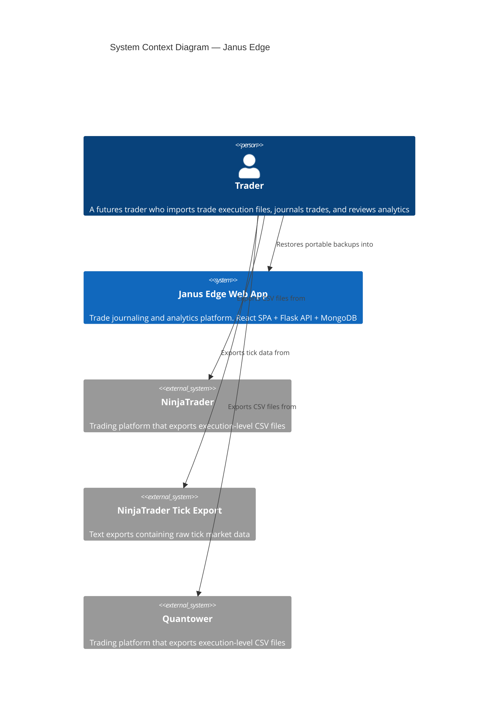

### Source Component Architecture Diagram

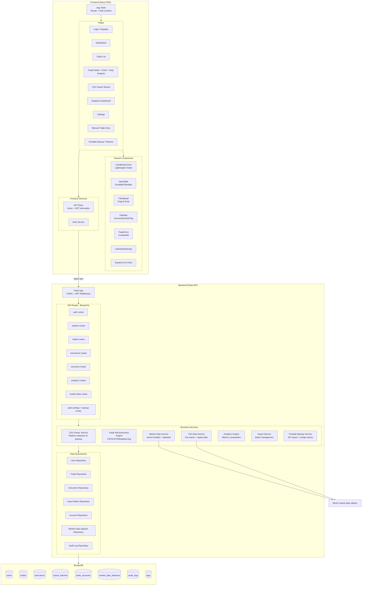

### Source Deployment Architecture Diagram

```mermaid
graph TB
	subgraph DockerCompose ["Docker Compose (Local Development)"]
		subgraph FrontendContainer ["frontend container"]
			Vite["Vite Dev Server<br/>:5173"]
		end
        
		subgraph BackendContainer ["backend container"]
			Flask["Flask Dev Server<br/>:5000"]
		end
        
		subgraph MongoContainer ["mongo container"]
			MongoDB["MongoDB 7.x<br/>:27017"]
		end
        
		subgraph MinIOContainer ["minio container"]
			MinIO["MinIO<br/>:9000 API / :9001 Console"]
		end
        
		subgraph MongoVolume ["mongo-data volume"]
			PersistentData["Persistent Data"]
		end
        
		subgraph MinIOVolume ["minio-data volume"]
			ObjectData["Object Data"]
		end
        
		Vite -->|"Proxy /api → backend:5000"| Flask
		Flask -->|"mongo:27017"| MongoDB
		Flask -->|"minio:9000"| MinIO
		MongoDB --> PersistentData
		MinIO --> ObjectData
	end
    
	subgraph Production ["Production Deployment (Future)"]
		subgraph WebServer ["Web Server"]
			Nginx["Nginx<br/>Reverse Proxy + Static Files"]
		end
        
		subgraph AppServer ["Application Server"]
			Gunicorn["Gunicorn<br/>Flask WSGI"]
		end
        
		subgraph DBProd ["Database"]
			MongoProd["MongoDB<br/>(Atlas or self-hosted)"]
		end
        
		Nginx -->|"/api/*"| Gunicorn
		Nginx -->|"Static React Build"| StaticFiles["React Build Artifacts"]
		Gunicorn --> MongoProd
	end
```

### Source Data Flow Diagram

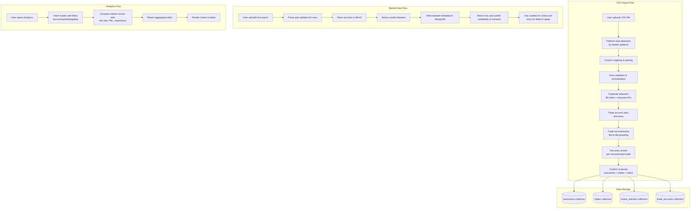

### Source Sequence Diagram: CSV Import

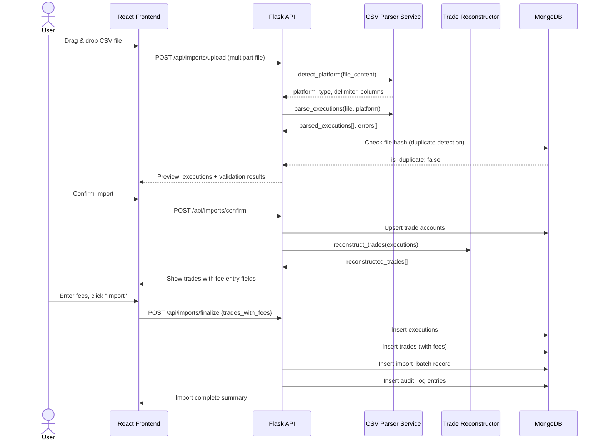

### Source Sequence Diagram: Trade Detail With Chart

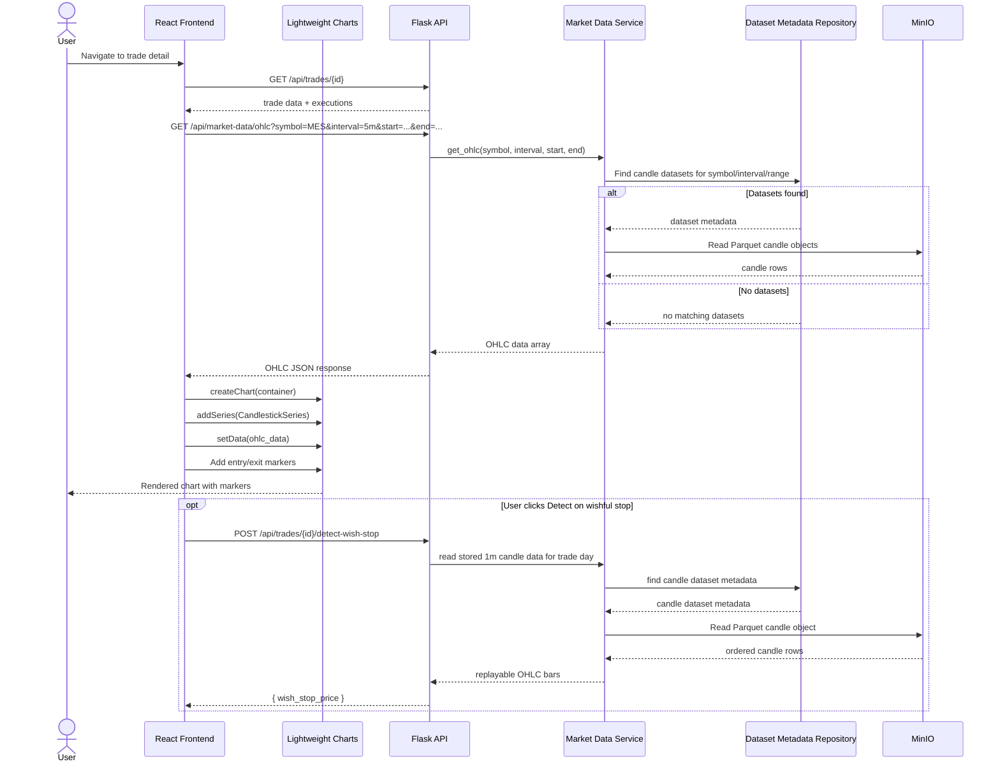

### Source Sequence Diagram: Authentication

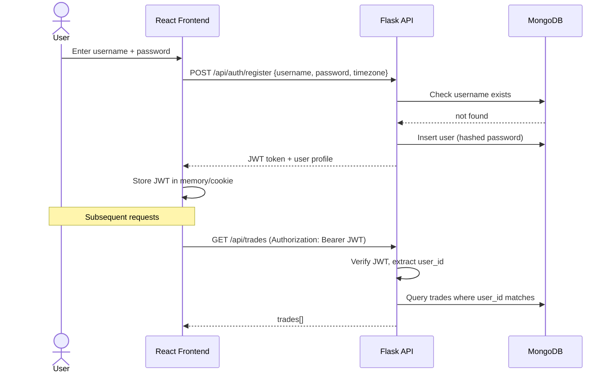

### Source Entity Relationship Diagram

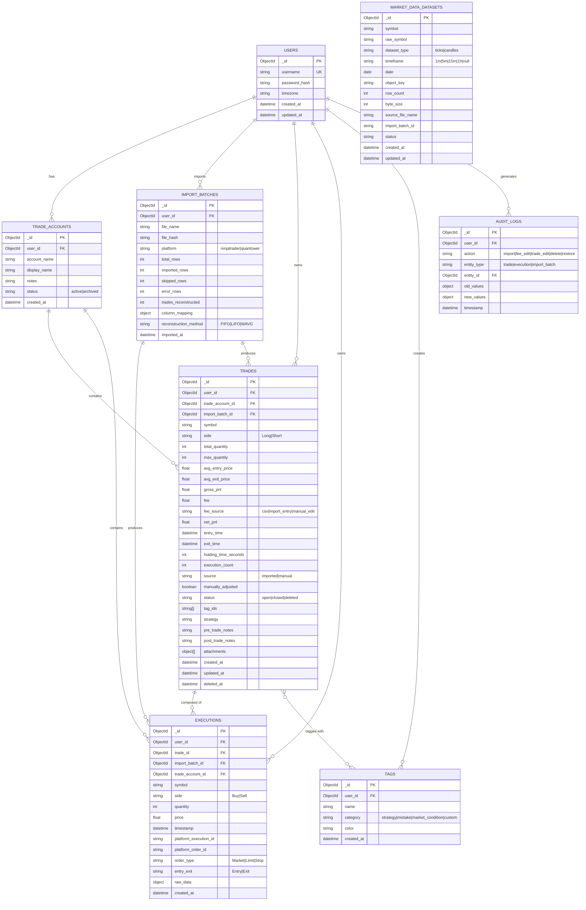
