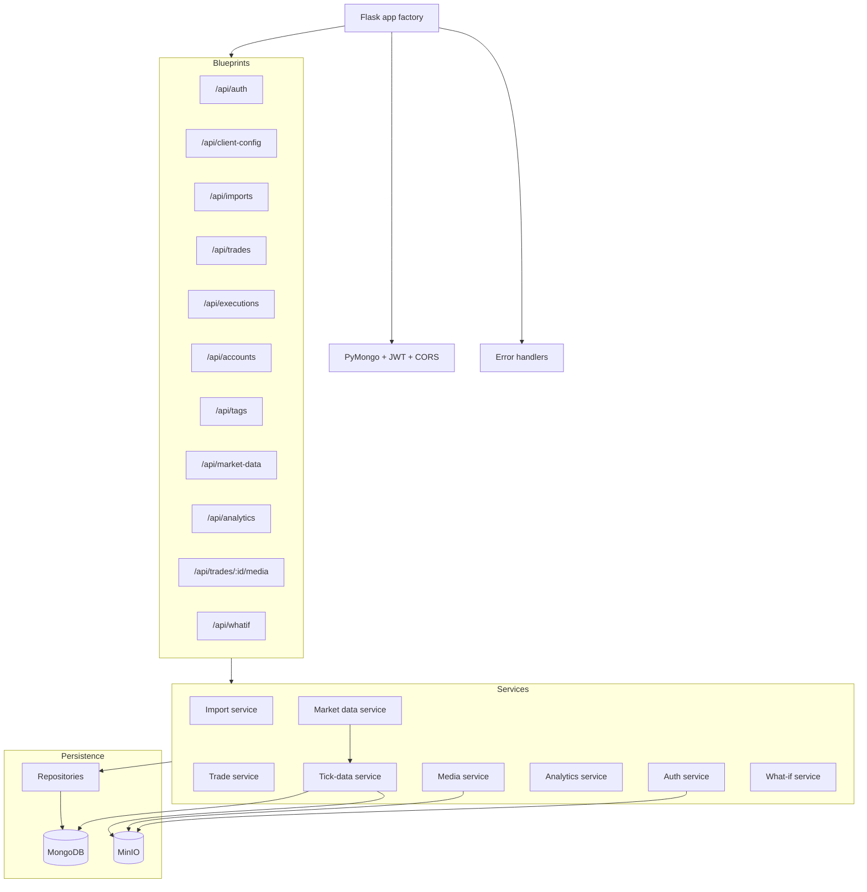
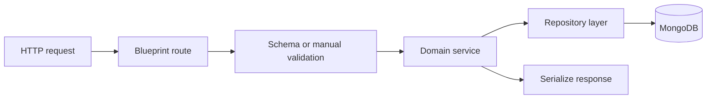
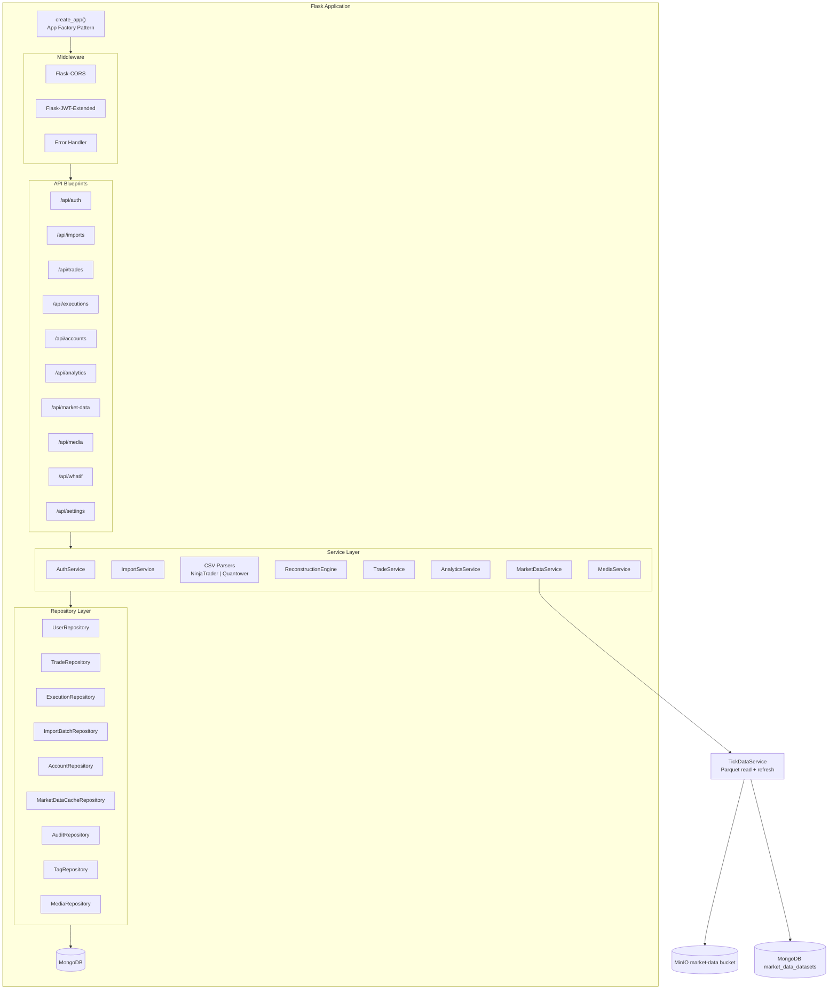
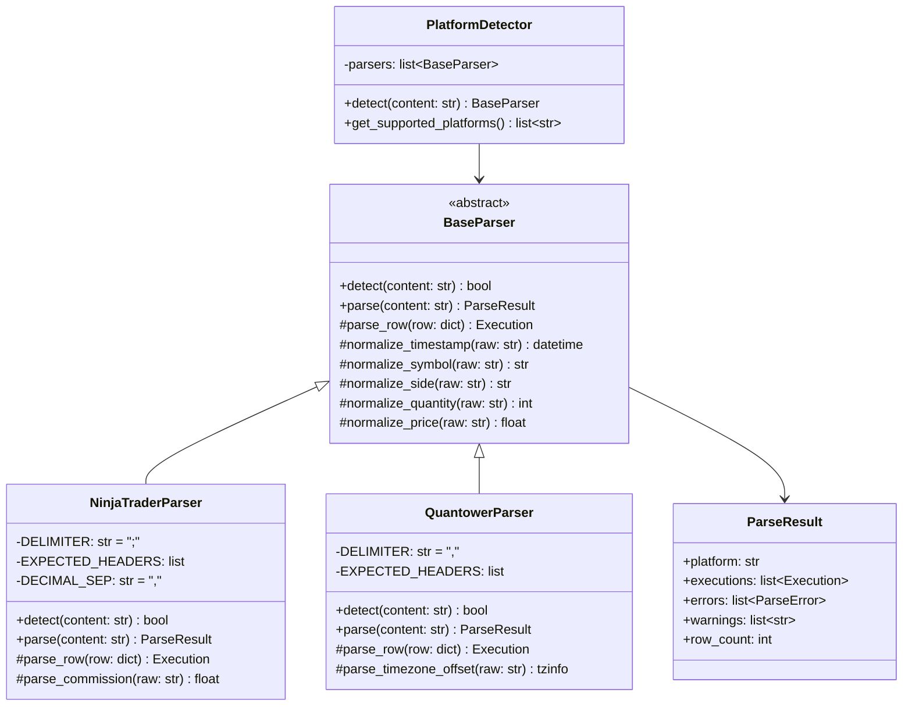
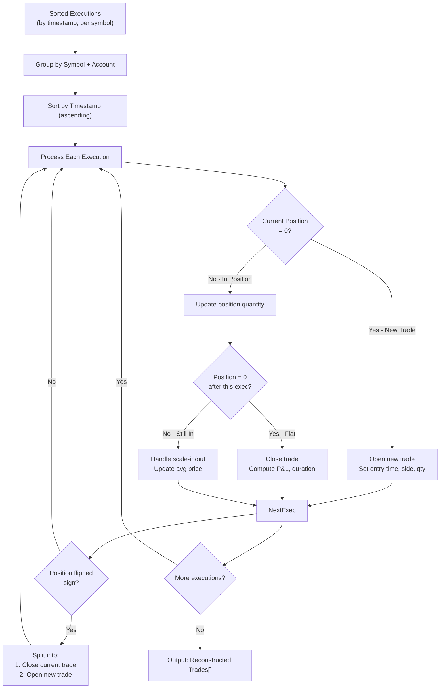
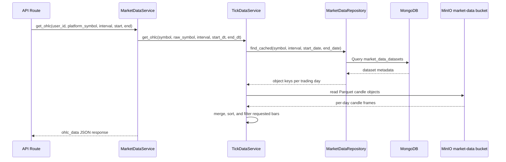
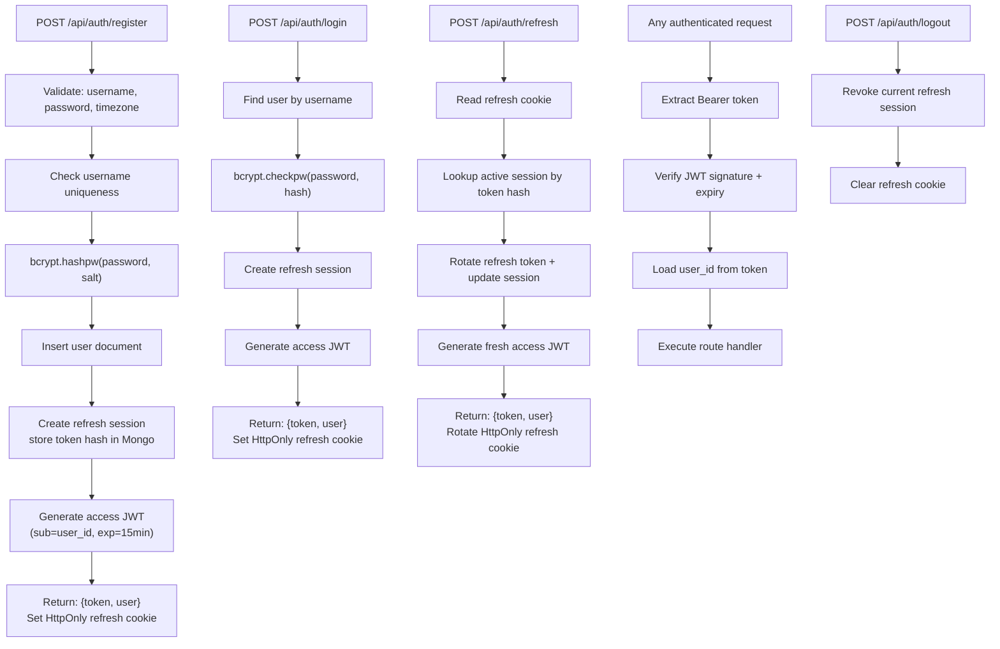

# Backend

## Overview

The backend is a Flask application in `backend/` that provides the repository's REST API. It handles:

- authentication
- persistent refresh-token sessions
- CSV import and trade reconstruction
- trade CRUD and search
- analytics aggregation and Monte Carlo simulation
- tick-data import, candle generation, and market-data retrieval
- media upload and download helpers
- portable backup export and restore

## Backend Component Diagram



## Entry Points

The runtime entry points are:

- `backend/run.py`: creates the app and exposes `app`
- `backend/app/__init__.py`: Flask app factory implementation
- `backend/config.py`: configuration classes and required-secret validation

## Startup Flow

On startup, the backend does the following:

1. Reads environment variables through `backend/config.py`.
2. Chooses a config class from `FLASK_ENV`.
3. Validates required secrets with `validate_config()`.
4. Initializes PyMongo, JWT, and CORS.
5. Registers global error handlers.
6. Registers all Flask blueprints.
7. Attempts to initialize MinIO storage and create the configured media and market-data buckets.
8. Attempts to create MongoDB indexes through `app/db.py`.

If MinIO is unavailable, the app logs a warning and continues booting, but media uploads and tick-data backed market-data reads will not work.

## Blueprint Modules

The current backend registers these blueprints:

| Folder | URL prefix | Purpose |
| --- | --- | --- |
| `app/auth/` | `/api/auth` | Auth, profile settings, backup export, backup restore |
| `app/client_config/` | `/api` | Public client config metadata for upload UIs |
| `app/imports/` | `/api/imports` | Upload, reconstruct, finalize import, list or delete batches |
| `app/trades/` | `/api/trades` | Trade CRUD, search, distinct symbol listing |
| `app/executions/` | `/api/executions` | Execution listing and single-execution lookup |
| `app/accounts/` | `/api/accounts` | Trade-account listing and update |
| `app/tags/` | `/api/tags` | Tag CRUD |
| `app/market_data/` | `/api/market-data` | OHLC retrieval and caching |
| `app/analytics/` | `/api/analytics` | Summary metrics, chart data, Monte Carlo |
| `app/media/` | `/api` | Media routes live at `/api/trades/:id/media` and `/api/media/:id` |
| `app/whatif/` | `/api/whatif` | Stop analysis and what-if simulation |

## Directory Structure

### Core application files

- `app/extensions.py`: shared Flask extension instances
- `app/db.py`: MongoDB index creation
- `app/storage.py`: MinIO client initialization and bucket helpers
- `app/middleware/error_handler.py`: shared HTTP error handling

### Domain layers

- `app/routes` are organized by feature through blueprint folders
- `app/repositories/` provides MongoDB access methods
- `app/models/` builds insertable document dicts
- `app/utils/` contains helpers for validation, dates, hashing, trade metrics, and trade fingerprints

## Configuration Behavior

The backend uses these config classes:

- `DevelopmentConfig`
- `TestingConfig`
- `ProductionConfig`

Notable behavior from `backend/config.py`:

- `SECRET_KEY`, `JWT_SECRET_KEY`, `MINIO_ACCESS_KEY`, and `MINIO_SECRET_KEY` must be present
- default development MongoDB URI is `mongodb://localhost:27017/janusedge`
- testing uses `MONGO_URI_TEST` if set, otherwise `mongodb://localhost:27017/janusedge_test`
- global request upload ceiling is `1.5 GB`
- CSV import and trade-media uploads remain capped at `500 MB`
- market-data tick-data uploads are capped at `1.5 GB`
- `GET /api/client-config` exposes the backend upload limits and accepted formats to the frontend
- CORS origins are read from `CORS_ORIGINS` and split on commas

For the full variable list, see [Configuration](../configuration.md).

## Persistence and Repositories

MongoDB access is centralized through repositories in `app/repositories/`.

The common base behavior includes:

- ObjectId conversion
- generic CRUD helpers
- aggregation helpers
- serialization of ObjectIds and datetimes for JSON responses

Serialization renames `_id` to `id` in API output.

## Authentication and Session Model

- JWT tokens are issued by Flask-JWT-Extended.
- Short-lived access tokens are expected in the `Authorization: Bearer <token>` header.
- Persistent browser sessions are backed by `auth_refresh_sessions` in MongoDB and an `HttpOnly` refresh cookie.
- `POST /api/auth/refresh` rotates the current refresh session and issues a new access token.
- Logout revokes the current browser refresh session and clears the cookie.
- Password changes revoke all persistent refresh sessions for that user.

## Import Pipeline

The import pipeline currently works like this:

1. Upload a CSV file.
2. Detect the source platform.
3. Parse execution rows.
4. Reconstruct flat-to-flat trades.
5. Finalize the import and persist trades, executions, and the import batch.

The implementation supports NinjaTrader and Quantower based on the parser detection logic in `app/imports/parsers/`.

## Request Handling Flow



## Market Data

Market data is derived from imported NinjaTrader tick exports.

The backend stores:

- raw daily ticks as Snappy-compressed Parquet objects in MinIO
- precomputed daily candle datasets for `1m`, `5m`, `15m`, and `1h` in MinIO
- dataset metadata in the `market_data_datasets` collection in MongoDB
- import progress in the `market_data_import_batches` collection in MongoDB

Market-data lookup and point-value lookup are configured separately:

- `symbol_mappings` controls dollar value per point by normalized base symbol.
- `market_data_mappings` controls explicit cross-symbol market-data lookup.
- When no `market_data_mappings` entry matches, the backend looks up the imported symbol as-is. There are no built-in cross-symbol defaults.

The resolved market-data key prefers `raw_symbol` when present and otherwise falls back to the normalized trade symbol. Each dataset metadata document includes the symbol, raw symbol, dataset type, timeframe, trading date, MinIO object key, row count, byte size, source file name, import batch id, and timestamps.

Authenticated tick-data endpoints:

- `POST /api/market-data/tick-imports/preview`: start a background preview batch for a NinjaTrader text export
- `GET /api/market-data/tick-imports/preview/:batch_id`: poll preview progress and completed preview payload
- `POST /api/market-data/tick-imports`: store the upload, start a background import, and create a progress-tracked batch
- `GET /api/market-data/tick-imports/:batch_id`: poll the current progress and status for an import batch
- maximum tick-data upload size: `1.5 GB`

`GET /api/market-data/ohlc` returns `{ ohlc_data: [...] }` with the
existing bar shape. `force_refresh=true` regenerates candle datasets
from stored raw ticks.

The What-If stop-management flow also uses this stored market-data system.
It supports two replay sources for wider-stop simulation:

- stored `1m` candle datasets generated from imported ticks
- stored raw tick datasets replayed by `last_price`

OHLC replay is the default mode and approximates intrabar path from the candle.
Tick replay is the higher-precision mode because it processes the stored ticks
in order.

The Trade Detail stop-analysis panel uses the stored `1m` candle dataset for
the trade entry day to suggest a wishful stop. The detector scans the first
completed adverse excursion after entry from candle highs and lows, then
places the suggestion one inferred tick beyond that excursion's extreme. Tick
size is inferred from the smallest positive same-day increment found across
OHLC prices, with a fallback of `0.01` when no increment can be inferred.

## Media Handling

The backend supports image and video uploads for trades.

Current limits and behavior:

- allowed types: JPEG, PNG, GIF, WebP, MP4, WebM, QuickTime
- maximum file size: `500 MB`
- maximum attachments per trade: `20`
- presigned download URLs expire after one hour

## Backup and Restore

Portable backups are implemented under `app/auth/backup_service.py`.

Current behavior:

- export produces a ZIP archive
- restore merges into the currently authenticated user
- username, password hash, JWT state, and source user IDs are not restored
- account and tag reuse is based on natural keys
- import batches reuse `file_hash`
- trade duplicates are skipped using a stable fingerprint
- all ready market-data datasets and referenced Parquet objects are included in the archive and restored idempotently by natural dataset key

## Development Commands

Install dependencies and run the API locally:

```bash
cd backend
cp .env.example .env
python -m venv .venv
source .venv/bin/activate
pip install -r requirements.txt
flask run --port 5000
```

Install development test dependencies:

```bash
pip install -r requirements-dev.txt
```

## Testing

The repository includes backend tests under `backend/tests/`.

Current test areas include:

- auth
- imports
- trades and tags
- analytics
- market data
- media
- what-if flows

Run the backend test suite with:

```bash
cd backend
source .venv/bin/activate
pytest
```

The checked-in dev dependencies include `pytest`, `pytest-cov`, `pytest-flask`, and `mongomock`.

## Current Implementation Notes

- The backend codebase and many comments still say Janus Edge.
- Some route docstrings are slightly out of date compared with the payloads the frontend actually consumes.
- There is a restore endpoint for trades, but the current delete implementation permanently removes trade records and related executions and media. That restore route is only useful if a trade document with `status: "deleted"` already exists from another code path or older data.

## Complete Backend Diagram Set

### Source Backend Component Architecture



### Source CSV Parser Architecture



### Source Trade Reconstruction Diagram



### Source Market Data Service Diagram



### Source Authentication Flow Diagram


