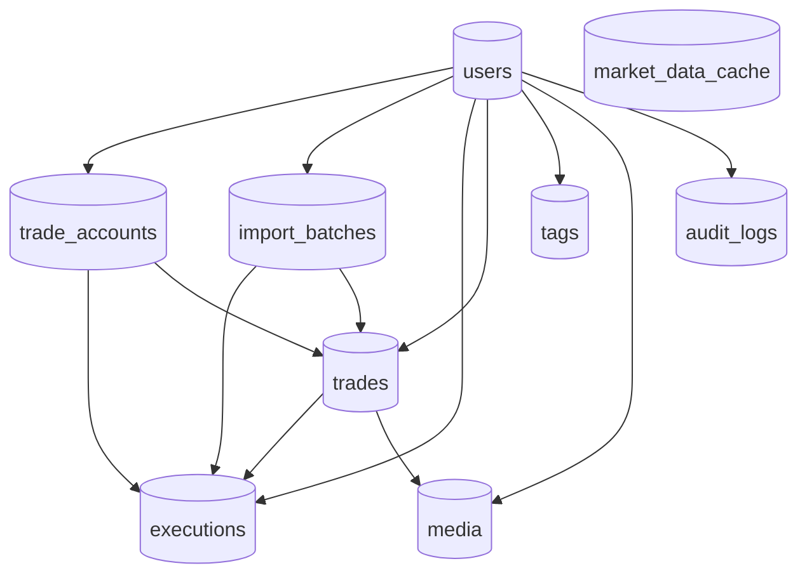
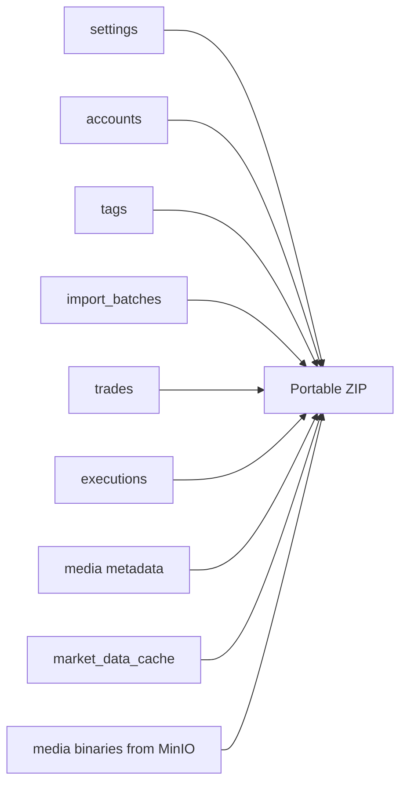
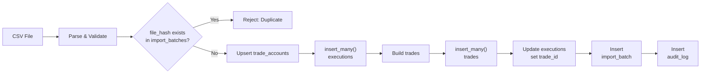
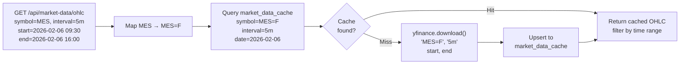

# Database

## Technology

The application uses MongoDB as its primary database.

The default development database names visible in code are:

- `janusedge` for development
- `janusedge_test` for tests

Media binaries are not stored in MongoDB. They are stored in MinIO, while MongoDB keeps the related metadata in the `media` collection.

## Collection Relationship Diagram



## Collections Present In The Codebase

The backend explicitly uses these MongoDB collections:

| Collection | Purpose |
| --- | --- |
| `users` | User accounts, password hashes, timezones, starting equity, and symbol mappings |
| `trade_accounts` | Imported or manual trading accounts per user |
| `import_batches` | Metadata for each imported CSV file |
| `executions` | Normalized execution-level rows from imported files |
| `trades` | Reconstructed or manually entered trades |
| `tags` | User-defined trade tags |
| `market_data_cache` | Cached OHLC slices fetched through `yfinance` |
| `audit_logs` | Audit trail records, currently including import events |
| `media` | Metadata for trade-related media stored in MinIO |

## Major Document Shapes

The shapes below are based on the document-construction helpers in `backend/app/models/` and on repository usage.

### `users`

```json
{
  "_id": "ObjectId",
  "username": "string",
  "password_hash": "string",
  "timezone": "string",
  "display_timezone": "string",
  "starting_equity": 10000.0,
  "symbol_mappings": {
    "MES": {
      "yahoo_symbol": "MES=F",
      "dollar_value_per_point": 5.0
    }
  },
  "created_at": "datetime",
  "updated_at": "datetime"
}
```

Notes:

- `symbol_mappings` is initialized with built-in defaults.
- Built-in defaults currently include MES, ES, MNQ, NQ, MYM, YM, MCL, CL, GC, and MGC.

### `trade_accounts`

```json
{
  "_id": "ObjectId",
  "user_id": "ObjectId",
  "account_name": "string",
  "display_name": "string",
  "notes": null,
  "status": "active",
  "source_platform": "manual | ninjatrader | quantower",
  "created_at": "datetime",
  "updated_at": "datetime"
}
```

### `import_batches`

```json
{
  "_id": "ObjectId",
  "user_id": "ObjectId",
  "file_name": "string",
  "file_hash": "string",
  "file_size_bytes": 12345,
  "platform": "ninjatrader | quantower",
  "column_mapping": {},
  "reconstruction_method": "FIFO | LIFO | WAVG",
  "stats": {
    "total_rows": 0,
    "imported_rows": 0,
    "skipped_rows": 0,
    "error_rows": 0,
    "trades_reconstructed": 0
  },
  "errors": [],
  "imported_at": "datetime"
}
```

### `executions`

```json
{
  "_id": "ObjectId",
  "user_id": "ObjectId",
  "trade_id": "ObjectId | null",
  "import_batch_id": "ObjectId",
  "trade_account_id": "ObjectId",
  "symbol": "string",
  "raw_symbol": "string",
  "side": "Buy | Sell",
  "quantity": 1,
  "price": 0.0,
  "timestamp": "datetime",
  "order_type": "string | null",
  "entry_exit": "string | null",
  "platform_execution_id": "string | null",
  "platform_order_id": "string | null",
  "commission": 0.0,
  "raw_data": {},
  "created_at": "datetime"
}
```

### `trades`

```json
{
  "_id": "ObjectId",
  "user_id": "ObjectId",
  "trade_account_id": "ObjectId",
  "import_batch_id": "ObjectId | null",
  "symbol": "string",
  "raw_symbol": "string",
  "side": "Long | Short",
  "total_quantity": 1,
  "max_quantity": 1,
  "avg_entry_price": 0.0,
  "avg_exit_price": 0.0,
  "gross_pnl": 0.0,
  "fee": 0.0,
  "fee_source": "csv | import_entry | manual_edit",
  "fee_last_edited": null,
  "net_pnl": 0.0,
  "initial_risk": 0.0,
  "entry_time": "datetime",
  "exit_time": "datetime",
  "holding_time_seconds": 0,
  "execution_count": 0,
  "source": "imported | manual",
  "manually_adjusted": false,
  "status": "open | closed | deleted",
  "tag_ids": [],
  "strategy": null,
  "pre_trade_notes": null,
  "post_trade_notes": null,
  "wish_stop_price": null,
  "target_price": null,
  "attachments": [],
  "created_at": "datetime",
  "updated_at": "datetime",
  "deleted_at": null
}
```

Notes:

- `target_price` is auto-populated for winning imported or manual trades.
- `wish_stop_price` is used by what-if analysis.
- `attachments` exists on the trade document model, but the active media feature uses the separate `media` collection plus MinIO. Treat `attachments` as legacy or currently unused unless new code begins writing to it.

### `tags`

```json
{
  "_id": "ObjectId",
  "user_id": "ObjectId",
  "name": "string",
  "category": "string",
  "color": "#6B7280",
  "created_at": "datetime"
}
```

### `market_data_cache`

```json
{
  "_id": "ObjectId",
  "symbol": "MES=F",
  "interval": "5m",
  "date": "datetime at day precision",
  "ohlc": [
    {
      "time": 1739145600,
      "open": 0.0,
      "high": 0.0,
      "low": 0.0,
      "close": 0.0,
      "volume": 0
    }
  ],
  "bar_count": 0,
  "fetched_at": "datetime",
  "source": "yfinance"
}
```

Notes:

- `symbol` stores the resolved Yahoo Finance ticker, not necessarily the platform symbol seen in imported CSV files.
- cache lookups are performed by `symbol + interval + date`.

### `media`

```json
{
  "_id": "ObjectId",
  "user_id": "ObjectId",
  "trade_id": "ObjectId",
  "object_key": "string",
  "original_filename": "string",
  "content_type": "string",
  "size_bytes": 0,
  "media_type": "image | video",
  "created_at": "datetime"
}
```

### `audit_logs`

```json
{
  "_id": "ObjectId",
  "user_id": "ObjectId",
  "action": "string",
  "entity_type": "string",
  "entity_id": "ObjectId",
  "old_values": {},
  "new_values": {},
  "metadata": {},
  "timestamp": "datetime"
}
```

## Relationships Between Persisted Objects

- One `users` document owns many `trade_accounts`, `import_batches`, `executions`, `trades`, `tags`, `media`, and `audit_logs`.
- One `trade_accounts` document can be referenced by many `executions` and `trades`.
- One `import_batches` document can produce many `executions` and `trades`.
- One `trades` document can reference many `executions` through `execution.trade_id`.
- One `trades` document can have many `media` rows through `media.trade_id`.
- Trade tags are many-to-many in practice through the `trades.tag_ids` array.

## Backup And Restore Data Coverage Diagram



## Indexes And Constraints

Indexes are created in `backend/app/db.py`.

### Unique indexes

- `users.username`
- `trade_accounts (user_id, account_name)`
- `import_batches (user_id, file_hash)`
- `tags (user_id, name)`
- `market_data_cache (symbol, interval, date)`

### Query-support indexes

- `trade_accounts (user_id, status)`
- `import_batches (user_id, imported_at desc)`
- `executions (user_id, symbol, timestamp)`
- `executions.trade_id`
- `executions.import_batch_id`
- `executions.trade_account_id`
- `trades` indexes on entry time, symbol, account, status, tags, side, and import batch
- `audit_logs` indexes on user and timestamp, entity reference, and user plus action plus timestamp
- `media (user_id, trade_id, created_at)`

### Query assumptions visible in code

- non-deleted trades are typically filtered as `status != "deleted"`
- distinct symbol lists only use trades with `status == "closed"`
- market-data caching assumes one document per Yahoo symbol, interval, and trading day
- import duplicate detection assumes `file_hash` uniqueness per user

## Backup, Export, And Restore Shape

Portable backups currently contain:

- `manifest.json`
- `data.json`
- media binaries stored under `media/...`

The exported JSON payload contains:

- `settings`
- `accounts`
- `tags`
- `import_batches`
- `trades`
- `executions`
- `media`
- `market_data_cache`

Restore is merge-only into the authenticated destination user.

Current restore behavior visible in `backend/app/auth/backup_service.py`:

- updates portable settings such as timezone, display timezone, starting equity, and symbol mappings
- reuses accounts by natural key
- reuses tags by natural key
- reuses import batches by `file_hash`
- skips duplicate trades by stable fingerprint
- upserts market-data cache by `symbol + interval + date`

It does not restore another user's identity, password hash, or JWT/session state.

## Complete Database Diagram Set

### Source Import Data Flow Diagram



### Source Market Data Cache Flow Diagram

