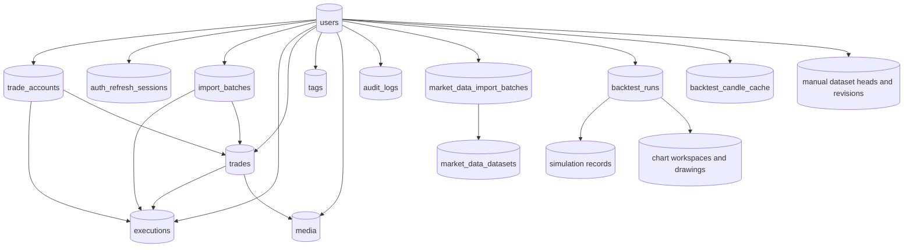
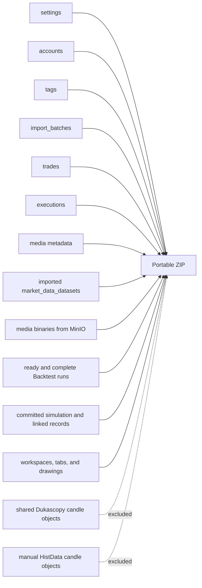
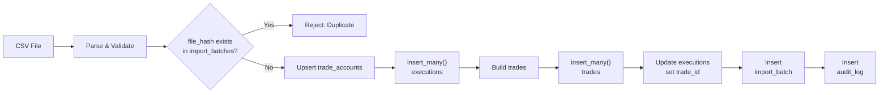
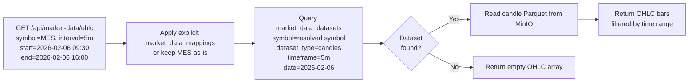

# Database

## Technology

The application uses MongoDB as its primary database.

The default development database names visible in code are:

- `janusedge` for development
- `janusedge_test` for tests

Media binaries, imported market-data partitions, and Backtest candle objects
are stored in MinIO. MongoDB stores their metadata and user/run references.

## Collection Relationship Diagram


```mermaid
graph TB
  Users[(users)]
  RefreshSessions[(auth_refresh_sessions)]
  Accounts[(trade_accounts)]
  Batches[(import_batches)]
  Executions[(executions)]
  Trades[(trades)]
  Tags[(tags)]
  Media[(media)]
  MarketDatasets[(market_data_datasets)]
  MarketBatches[(market_data_import_batches)]
  BacktestRuns[(backtest_runs)]
  BacktestCache[(backtest_candle_cache)]
  ManualDatasets[(manual dataset heads and revisions)]
  Simulation[(simulation records)]
  ChartState[(chart workspaces and drawings)]
  Audit[(audit_logs)]

  Users --> Accounts
  Users --> RefreshSessions
  Users --> Batches
  Users --> Executions
  Users --> Trades
  Users --> Tags
  Users --> Media
  Users --> Audit
  Users --> MarketBatches
  Users --> BacktestRuns
  Users --> BacktestCache
  Users --> ManualDatasets
  Accounts --> Executions
  Accounts --> Trades
  Batches --> Executions
  Batches --> Trades
  Trades --> Executions
  Trades --> Media
  MarketBatches --> MarketDatasets
  BacktestRuns --> Simulation
  BacktestRuns --> ChartState
```

## Collections Present In The Codebase

The backend explicitly uses these MongoDB collections:

| Collection | Purpose |
| --- | --- |
| `users` | User accounts, password hashes, timezones, starting equity, and symbol mappings |
| `auth_refresh_sessions` | Persistent browser refresh sessions owned by a user |
| `trade_accounts` | Imported or manual trading accounts per user |
| `import_batches` | Metadata for each imported CSV file |
| `executions` | Normalized execution-level rows from imported files |
| `trades` | Reconstructed or manually entered trades |
| `tags` | User-defined trade tags |
| `market_data_datasets` | Metadata for stored tick and candle Parquet datasets |
| `market_data_import_batches` | Progress and result metadata for tick-data imports |
| `backtest_runs` | Run settings, source manifest, progress, cursor, and recovery state |
| `backtest_preparation_jobs` | Durable, leased preparation and random-period selection jobs |
| `backtest_candle_cache` | User-scoped Dukascopy cache metadata and date-level coordination leases |
| `backtest_manual_dataset_heads` | Active manual-import revision per user and instrument |
| `backtest_manual_dataset_revisions` | Immutable HistData revision manifests and coverage |
| `backtest_simulation_operations` | Idempotent journal of committed simulation operations |
| `backtest_simulation_orders` | Versioned working and completed simulation orders |
| `backtest_simulation_positions` | Versioned open and closed simulated positions |
| `backtest_simulation_cost_profiles` | Versioned execution-cost settings per run |
| `backtest_chart_tabs` | Legacy tab records retained for workspace migration |
| `backtest_chart_workspaces` | Revisioned chart layout and panel metadata |
| `backtest_drawing_states` | Saved drawing payloads per run and interval |
| `backtest_notices` | Dismissible preparation result notices |
| `audit_logs` | Audit trail records, currently including import events |
| `media` | Metadata for trade-related media stored in MinIO |

Backtest fills are stored as extended records in `executions`, linked to the
run, operation sequence, order, and simulated position/trade. Readers expose
run-owned simulation records only through the committed sequence and active
reset generation.

Backtest candle bytes live in MinIO rather than MongoDB. Dukascopy run manifests
refer to normalized one-minute user-scoped cache objects; `backtest_candle_cache`
tracks their cache keys, state, and leases. HistData imports use separate
user-scoped immutable revision manifests and candle objects. A run pins its
source references and does not contain a second candle copy.

## Major Document Shapes

The shapes below are based on the document-construction helpers in `backend/app/models/` and on repository usage.

### `users`

```json
{
  "_id": "ObjectId",
  "username": "string",
  "password_hash": "string",
  "timezone": "string",
  "display_timezone": "string",
  "starting_equity": 10000.0,
  "symbol_mappings": {
    "MES": {
      "dollar_value_per_point": 5.0
    },
    "forex": {
      "EUR/USD": {
        "base_currency": "EUR",
        "quote_currency": "USD",
        "pip_size": 0.0001,
        "price_precision": 5,
        "contract_size": 100000
      }
    }
  },
  "market_data_mappings": {
    "MES": "ES"
  },
  "created_at": "datetime",
  "updated_at": "datetime"
}
```

Notes:

- `symbol_mappings` is initialized with built-in futures point-value defaults and a nested `forex` mapping.
- Forex entries retain base/quote currency, pip size, decimal precision, and contract size. Legacy futures entries remain top-level.
- `market_data_mappings` is initialized to an empty object.
- An empty `market_data_mappings` object means market data lookup uses the symbol as stored on the trade or dataset.

### `trade_accounts`

```json
{
  "_id": "ObjectId",
  "user_id": "ObjectId",
  "account_name": "string",
  "display_name": "string",
  "notes": null,
  "status": "active",
  "source_platform": "manual | ninjatrader | quantower",
  "created_at": "datetime",
  "updated_at": "datetime"
}
```

### `import_batches`

```json
{
  "_id": "ObjectId",
  "user_id": "ObjectId",
  "file_name": "string",
  "file_hash": "string",
  "file_size_bytes": 12345,
  "platform": "ninjatrader | quantower",
  "column_mapping": {},
  "reconstruction_method": "FIFO | LIFO | WAVG",
  "stats": {
    "total_rows": 0,
    "imported_rows": 0,
    "skipped_rows": 0,
    "error_rows": 0,
    "trades_reconstructed": 0
  },
  "errors": [],
  "imported_at": "datetime"
}
```

### `executions`

```json
{
  "_id": "ObjectId",
  "user_id": "ObjectId",
  "trade_id": "ObjectId | null",
  "import_batch_id": "ObjectId",
  "trade_account_id": "ObjectId",
  "symbol": "string",
  "raw_symbol": "string",
  "side": "Buy | Sell",
  "quantity": 1,
  "price": 0.0,
  "timestamp": "datetime",
  "order_type": "string | null",
  "entry_exit": "string | null",
  "platform_execution_id": "string | null",
  "platform_order_id": "string | null",
  "commission": 0.0,
  "raw_data": {},
  "created_at": "datetime"
}
```

### `trades`

```json
{
  "_id": "ObjectId",
  "user_id": "ObjectId",
  "trade_account_id": "ObjectId",
  "import_batch_id": "ObjectId | null",
  "symbol": "string",
  "raw_symbol": "string",
  "side": "Long | Short",
  "total_quantity": 1,
  "max_quantity": 1,
  "avg_entry_price": 0.0,
  "avg_exit_price": 0.0,
  "gross_pnl": 0.0,
  "fee": 0.0,
  "fee_source": "csv | import_entry | manual_edit",
  "fee_last_edited": null,
  "net_pnl": 0.0,
  "initial_risk": 0.0,
  "entry_time": "datetime",
  "exit_time": "datetime",
  "holding_time_seconds": 0,
  "execution_count": 0,
  "source": "imported | manual",
  "instrument_type": "futures | forex",
  "lot_size": null,
  "base_currency": null,
  "quote_currency": null,
  "pip_size": null,
  "price_precision": null,
  "contract_size": null,
  "pip_value_per_standard_lot": null,
  "pips": null,
  "native_pnl": null,
  "native_pnl_currency": null,
  "quote_to_usd_rate": null,
  "manually_adjusted": false,
  "status": "open | closed | deleted",
  "tag_ids": [],
  "strategy": null,
  "pre_trade_notes": null,
  "post_trade_notes": null,
  "wish_stop_price": null,
  "target_price": null,
  "attachments": [],
  "created_at": "datetime",
  "updated_at": "datetime",
  "deleted_at": null
}
```

Notes:

- `target_price` is auto-populated for winning imported or manual trades.
- For manual forex trades, `total_quantity` and `max_quantity` mirror fractional `lot_size` for compatibility. `gross_pnl` and `net_pnl` are USD; `native_pnl` is gross P&L in the quote currency and `pips` is signed.
- `quote_to_usd_rate` always means USD per one unit of the quote currency and is stored as `1` for USD-quoted instruments.
- `wish_stop_price` is used by what-if analysis.
- `attachments` exists on the trade document model, but the active media feature uses the separate `media` collection plus MinIO. Treat `attachments` as legacy or currently unused unless new code begins writing to it.

### `tags`

```json
{
  "_id": "ObjectId",
  "user_id": "ObjectId",
  "name": "string",
  "category": "string",
  "color": "#6B7280",
  "created_at": "datetime"
}
```

### `market_data_datasets`

```json
{
  "_id": "ObjectId",
  "symbol": "MES",
  "raw_symbol": "MES 06-26",
  "dataset_type": "candles",
  "timeframe": "5m",
  "date": "datetime at day precision",
  "object_key": "MES/candles/5m/2026/01/02.parquet",
  "row_count": 0,
  "byte_size": 0,
  "source_file_name": "MES 06-26.Last.txt",
  "import_batch_id": "string or null",
  "status": "ready",
  "created_at": "datetime",
  "updated_at": "datetime"
}
```

Notes:

- one metadata document exists per `symbol + dataset_type + timeframe + date`
- `dataset_type` is `ticks` for raw daily ticks and `candles` for precomputed bar datasets
- Parquet payloads live in MinIO; MongoDB stores only indexing metadata and import provenance

### `media`

```json
{
  "_id": "ObjectId",
  "user_id": "ObjectId",
  "trade_id": "ObjectId",
  "object_key": "string",
  "original_filename": "string",
  "content_type": "string",
  "size_bytes": 0,
  "media_type": "image | video",
  "created_at": "datetime"
}
```

### `audit_logs`

```json
{
  "_id": "ObjectId",
  "user_id": "ObjectId",
  "action": "string",
  "entity_type": "string",
  "entity_id": "ObjectId",
  "old_values": {},
  "new_values": {},
  "metadata": {},
  "timestamp": "datetime"
}
```

## Relationships Between Persisted Objects

- One `users` document owns many `trade_accounts`, `import_batches`, `executions`, `trades`, `tags`, `media`, and `audit_logs`.
- One `users` document owns many `auth_refresh_sessions` and market-data import batches.
- One `users` document owns many Backtest runs, Dukascopy cache references, and manual dataset heads/revisions.
- One `trade_accounts` document can be referenced by many `executions` and `trades`.
- One `import_batches` document can produce many `executions` and `trades`.
- One `trades` document can reference many `executions` through `execution.trade_id`.
- One `trades` document can have many `media` rows through `media.trade_id`.
- Trade tags are many-to-many in practice through the `trades.tag_ids` array.

## Account Deletion Coverage

`DELETE /api/auth/account` permanently deletes the authenticated user's
document, refresh sessions, trade accounts, CSV import batches, executions,
trades, tags, tag categories, audit logs, market-data import batches, and media
metadata. It also removes all MinIO media objects under the user's object-key
prefix.

`market_data_datasets` and their Parquet objects are shared across accounts
and do not contain `user_id`, so they are intentionally preserved during
account deletion. The current account-deletion service does not include the
new Backtest run/cache/revision collections or their MinIO candle objects;
those can remain after deleting an account. Per-run deletion does clean its
run-owned records while preserving the shared user-scoped candle cache.

## Backup And Restore Data Coverage Diagram


```mermaid
flowchart LR
  Settings[settings] --> Archive[Portable ZIP]
  Accounts[accounts] --> Archive
  Tags[tags] --> Archive
  Batches[import_batches] --> Archive
  Trades[trades] --> Archive
  Executions[executions] --> Archive
  MediaMeta[media metadata] --> Archive
  MarketDatasets[imported market_data_datasets] --> Archive
  MediaFiles[media binaries from MinIO] --> Archive
  BacktestRuns[ready and complete Backtest runs] --> Archive
  Simulation[committed simulation and linked records] --> Archive
  ChartState[workspaces, tabs, and drawings] --> Archive
  DukascopyBytes[shared Dukascopy candle objects] -. excluded .-> Archive
  ManualBytes[manual HistData candle objects] -. excluded .-> Archive
```

## Indexes And Constraints

Indexes are created in `backend/app/db.py`.

### Unique indexes

- `users.username`
- `trade_accounts (user_id, account_name)`
- `import_batches (user_id, file_hash)`
- `tags (user_id, name)`
- `market_data_datasets (symbol, dataset_type, timeframe, date)`
- `backtest_candle_cache (user_id, cache_key)`
- `backtest_manual_dataset_heads (user_id, instrument)`
- `backtest_manual_dataset_revisions (user_id, instrument, created_at)`
- `backtest_runs (user_id, created_at)` and portable source identity
- run-scoped indexes for preparation jobs, simulation operations/entities, chart state, and notices

### Query-support indexes

- `trade_accounts (user_id, status)`
- `import_batches (user_id, imported_at desc)`
- `executions (user_id, symbol, timestamp)`
- `executions.trade_id`
- `executions.import_batch_id`
- `executions.trade_account_id`
- `trades` indexes on entry time, symbol, account, status, tags, side, and import batch
- `audit_logs` indexes on user and timestamp, entity reference, and user plus action plus timestamp
- `media (user_id, trade_id, created_at)`

### Query assumptions visible in code

- non-deleted trades are typically filtered as `status != "deleted"`
- distinct symbol lists only use trades with `status == "closed"`
- market-data datasets are keyed by resolved dataset symbol, dataset type, optional timeframe, and trading day
- import duplicate detection assumes `file_hash` uniqueness per user

## Backup, Export, And Restore Shape

Portable backups currently contain:

- `manifest.json`
- `data.json`
- media binaries stored under `media/...`
- format 1.1 Backtest metadata and committed state for ready/complete runs
- imported market-data datasets and their Parquet objects, as before
- no shared replay/conversion candle bytes, manual candle bytes, or source-cache object keys

The exported JSON payload contains:

- `settings`
- `accounts`
- `tags`
- `import_batches`
- `trades`
- `executions`
- `media`
- `market_data_datasets`
- `backtests` (format 1.1)

Restore is merge-only into the authenticated destination user.

Current restore behavior visible in `backend/app/auth/backup_service.py`:

- updates portable settings such as timezone, display timezone, starting equity, symbol mappings, and market-data mappings
- reuses accounts by natural key
- reuses tags by natural key
- reuses import batches by `file_hash`
- skips duplicate trades by stable fingerprint
- upserts imported market-data datasets by their natural dataset key
- binds restored run manifests to matching destination-owned candle cache entries when available
- uses stable source identities to reuse restored Backtest runs and linked records
- reports Backtest run `created` and `reused` counts

It does not restore another user's identity, password hash, or JWT/session state.
Format 1.0 archives remain supported without Backtest records. Missing
Dukascopy data uses explicit cache recovery; missing manual candles require
matching HistData re-upload. Opening a restored run does not start recovery.

## Complete Database Diagram Set

### Source Import Data Flow Diagram


```mermaid
flowchart LR
  CSVFile["CSV File"] --> Parse["Parse & Validate"]
  Parse --> CheckHash{"file_hash exists<br/>in import_batches?"}
    
  CheckHash -->|Yes| Reject["Reject: Duplicate"]
  CheckHash -->|No| UpsertAcct["Upsert trade_accounts"]
    
  UpsertAcct --> InsertExecs["insert_many()<br/>executions"]
  InsertExecs --> Reconstruct["Build trades"]
  Reconstruct --> InsertTrades["insert_many()<br/>trades"]
  InsertTrades --> UpdateExecs["Update executions<br/>set trade_id"]
  UpdateExecs --> InsertBatch["Insert<br/>import_batch"]
  InsertBatch --> InsertAudit["Insert<br/>audit_log"]
```

### Source Market Data Lookup Flow Diagram


```mermaid
flowchart LR
  Request["GET /api/market-data/ohlc<br/>symbol=MES, interval=5m<br/>start=2026-02-06 09:30<br/>end=2026-02-06 16:00"]

  Request --> ResolveSymbol["Apply explicit market_data_mappings<br/>or keep MES as-is"]
  ResolveSymbol --> QueryMetadata["Query market_data_datasets<br/>symbol=resolved symbol<br/>dataset_type=candles<br/>timeframe=5m<br/>date=2026-02-06"]

  QueryMetadata --> DatasetFound{Dataset<br/>found?}

  DatasetFound -->|Yes| ReadParquet["Read candle Parquet from MinIO"]
  ReadParquet --> ReturnBars["Return OHLC bars<br/>filtered by time range"]

  DatasetFound -->|No| ReturnEmpty["Return empty OHLC array"]
```
