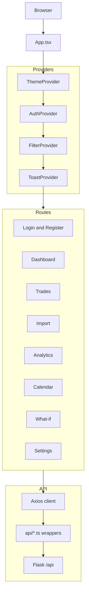
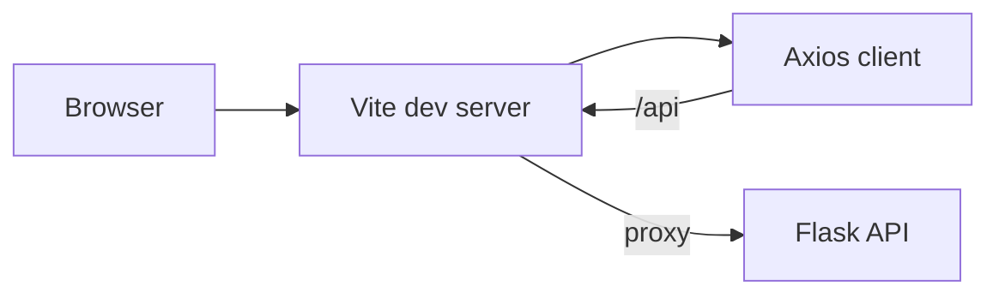
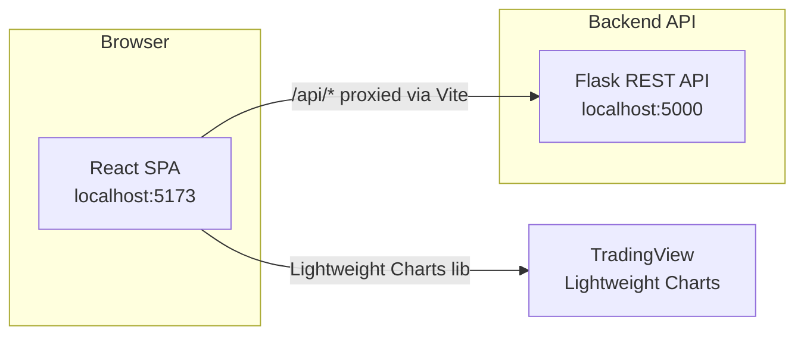
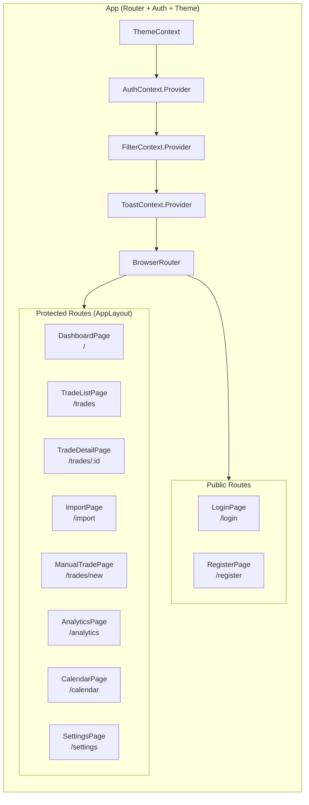
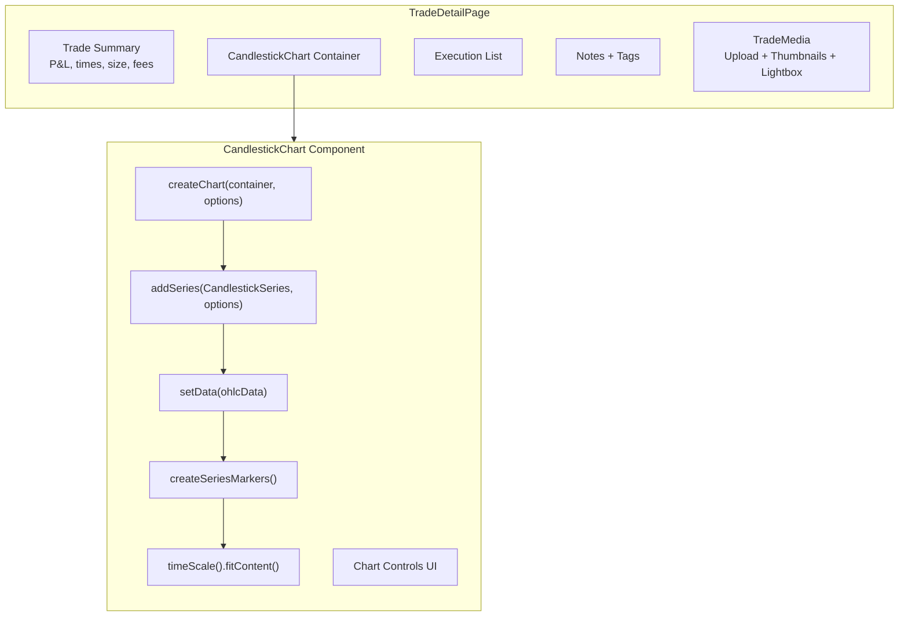
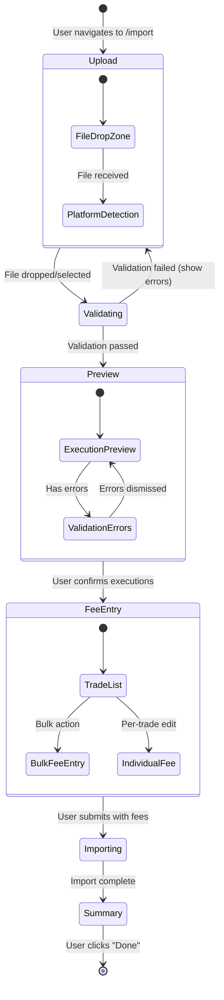
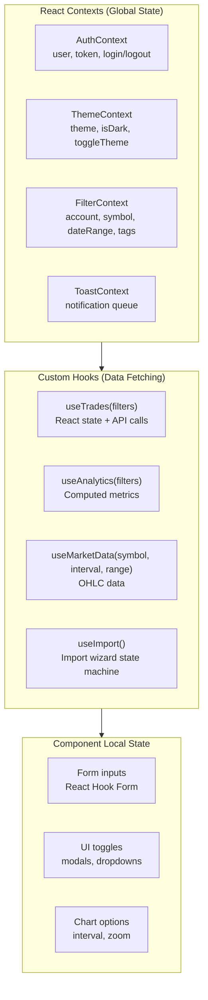
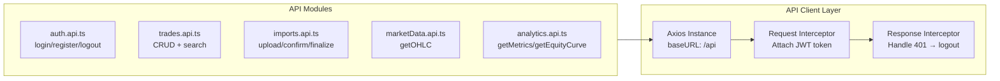

# Frontend

## Overview

The frontend is a Vite-based React and TypeScript single-page application in `frontend/`.

It provides the user-facing workflows for:

- authentication
- dashboard analytics
- trade list and trade detail views
- manual trade entry
- CSV import
- dedicated market-data import for NinjaTrader tick-data files
- calendar and analytics pages
- what-if analysis and Monte Carlo simulation
- settings, point-value symbol mappings, and backup restore

Important naming note: the current frontend display name is hard-coded as `Janus Edge` in `src/utils/constants.ts`. The `VITE_APP_NAME` environment variable exists in example files and Docker Compose, but the current frontend source does not read it.

## Frontend Structure Diagram



## Entry Points

- `frontend/index.html`: Vite HTML entry
- `frontend/src/main.tsx`: React bootstrap
- `frontend/src/App.tsx`: routing, providers, and top-level error boundary

## Main Folders

| Folder | Purpose |
| --- | --- |
| `src/api/` | HTTP client wrappers for backend endpoints |
| `src/components/` | Shared UI, layout, charts, trade, import, and analytics components |
| `src/contexts/` | Auth, theme, filter, and toast providers |
| `src/hooks/` | Feature-oriented React hooks |
| `src/pages/` | Route-level pages |
| `src/types/` | TypeScript API and view-model types |
| `src/utils/` | Formatting helpers, constants, validators, and date utilities |
| `src/styles/` | Global CSS and Tailwind-driven styling |

## Routing

The current application routes are defined in `src/App.tsx`.

### Public routes

- `/login`
- `/register`

### Protected routes

- `/`
- `/trades`
- `/trades/new`
- `/trades/:id`
- `/import`
- `/market-data/import`
- `/analytics`
- `/calendar`
- `/whatif`
- `/settings`

Protected routes are wrapped by `ProtectedRoute`, which redirects unauthenticated users to `/login`.

## How The Frontend Talks To The Backend

The frontend uses Axios through `src/api/client.ts`.

Current behavior:

- base URL is `VITE_API_BASE_URL`, defaulting to `/api`
- JWT tokens are read from `sessionStorage`
- each request gets an `Authorization: Bearer <token>` header when a token exists
- any `401` response clears auth state in `sessionStorage` and redirects to `/login`

During development, `vite.config.ts` proxies `/api` requests to `VITE_API_PROXY_TARGET`, which defaults to `http://localhost:5000`.

## Development Request Diagram



## State and Persistence

### Authentication

- `AuthContext` manages the current user and token
- the token is stored in `sessionStorage`
- the profile is fetched on app startup when a token exists

### Theme

- the app uses a theme provider and Tailwind dark-mode classes
- the theme preference is stored in `localStorage` under `janusedge-theme`

### Filters and Notifications

- `FilterContext` keeps shared trade and analytics filters
- `ToastContext` manages transient notifications

## Notable Feature Areas

### Dashboard

The dashboard currently includes:

- summary cards
- equity curve
- drawdown chart
- APPT charts
- win-rate charts
- tag-level performance
- evolution analytics tab

### Import Wizard

The import page is a multi-step flow:

1. Upload CSV
2. Preview parsed executions
3. Assign fees and initial risk
4. Finalize and view summary

The page explicitly mentions NinjaTrader and Quantower support.

### Market Data Import

The frontend includes a dedicated `/market-data/import` flow for NinjaTrader tick-data `.txt` files.

That page:

- uploads a single tick-data text export
- previews parsed trading dates and tick counts before ingestion
- starts an authenticated background import batch
- polls batch progress until completion or failure
- uses the same backend market-data store consumed by trade charts and what-if analysis

On the What-if stop-management tab, the frontend treats raw tick data as
the authoritative replay source. The wicked-out list reports tick-data
availability, and the What-If Calculator skips trades that do not have usable
stored ticks for replay.

### Trade Detail

The trade detail page combines:

- trade summary metrics
- execution list
- candlestick chart
- notes
- tags
- stop-analysis fields
- media attachments

### Settings

The settings page currently includes:

- password change
- trading timezone
- display timezone
- starting equity
- base-symbol point-value editor
- backup export and restore

## Local Development Workflow

Use the frontend locally with:

```bash
cd frontend
cp .env.example .env.local
npm install
npm run dev
```

By default, the frontend will be available at `http://localhost:5173`.

If the backend is also running locally, no extra proxy changes are required because `frontend/.env.example` already points to `http://localhost:5000`.

If the backend is running in Docker Compose and port `5000` is published to the host, the same default still works.

## Build and Other Commands

The current scripts in `frontend/package.json` are:

```bash
npm run dev
npm run build
npm run lint
npm run preview
```

`npm run build` executes:

```bash
tsc --noEmit && vite build
```

## Testing Status

There is currently no dedicated frontend test script in `frontend/package.json`.

That means the checked-in frontend verification path is presently:

- type-check through the build command
- lint with ESLint

If you need a frontend test suite, treat that as a TODO rather than an existing documented capability.

## Complete Frontend Diagram Set

### Source Frontend System Context Diagram



### Source Component Architecture Diagram



### Source CandlestickChart Diagram



### Source CSV Import Wizard Diagram



### Source State Management Diagram



### Source API Client Architecture Diagram


